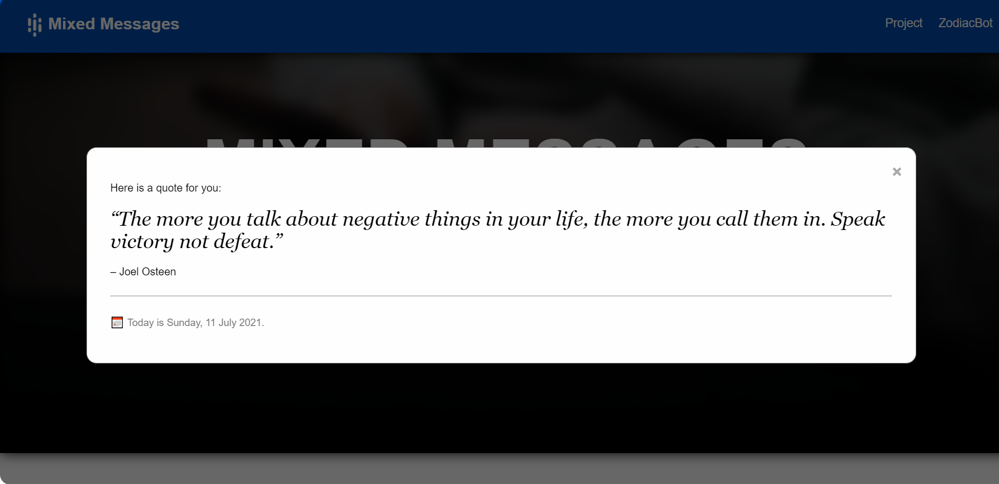
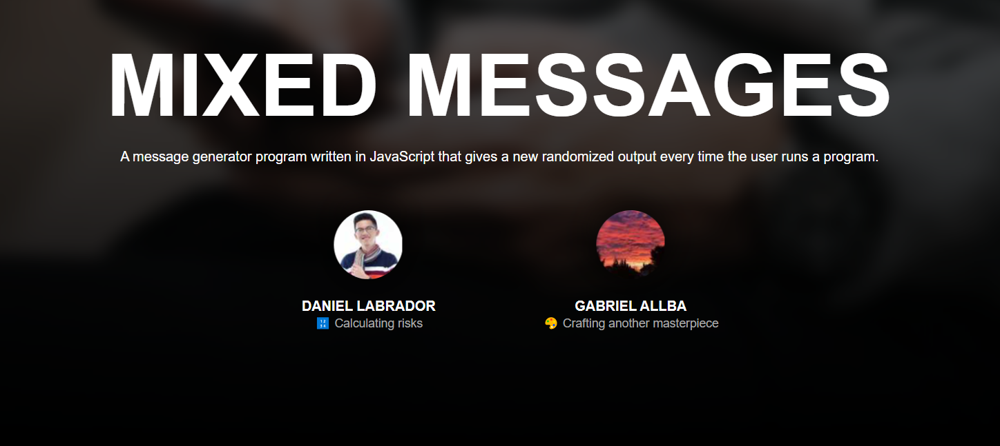
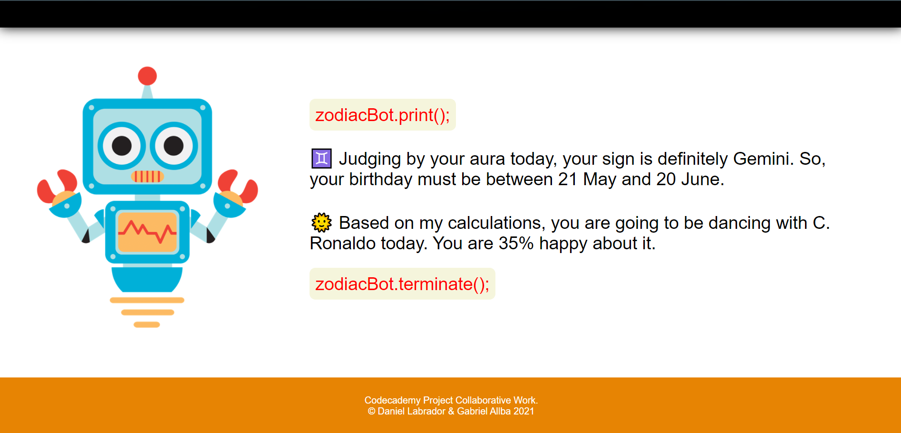

# **Mixed Message**
A message generator program powered by Javascript that gives a new randomized output every time the user loads the webpage or runs a program. This collaborative training project aims to showcase their acquired knowledge after taking up [Codecademy lessons](https://www.codecademy.com/learn/paths/full-stack-engineer-career-path) on the fundamentals of JavaScript and learn how to use the command line and GitHub for remote collaboration.

## Table of Contents
- [General information](#general-information)
- [Technologies](#technologies)
- [Setup](#setup)
- [Status](#status)
- [Notes](#notes)
- [Launch](#launch)

## General information
Codecademy, as part of the career path training, requires its students to create a program that will showcase their knowledge obtained after following the first two JavaScript sections and demonstrate what the proponents know of JavaScript syntax so far. The course requires its students to write a program which outputs a message composed of at least three (3) random pieces of data.

## Technologies
- HTML 5
- CSS 3
- JavaScript ES6

## Setup
To run this project, open a modern web browser that can run the technologies aforementioned. Since, making the webpage responsive is not a requirement, the webpage can only be viewed on a PC/Mac. Mobile web browsers may not be compatible for viewing the HTML file.

## Features
The team came up with an interactive website that returns random messages at three specific key events:
1. 15 seconds after the page is loaded, a message will pop up on the browser with a quote that varies depending on what day it is when the user accessed the HTML file. The pop up message will also show the current day and the date;      
2. In the header section, below the developers' names are random items from an array that the program returned after the page is loaded; and      
3. The button returns 6 random items from 3 independent arrays and 3 co-dependent arrays stored in an object.    

## Sources
The techniques utilized was based on the lessons taught in [Codecademy's Full-Stack Career Path](https://www.codecademy.com/learn/paths/full-stack-engineer-career-path).
To achieve the modal pop up box, the developers took inpiration to this [resource](https://www.w3schools.com/howto/howto_css_modals.asp).

## Notes
The project was a collaborative effort of [Daniel Labrador](https://github.com/daniellabrador) and [Gabriel Allba](https://github.com/GabrielAllba). We live in different timezones, so the collaboration was done remotely.

## Launch
See [Mixed-Message](https://gabrielallba.github.io/Mixed-Message/){target="_blank} here.
